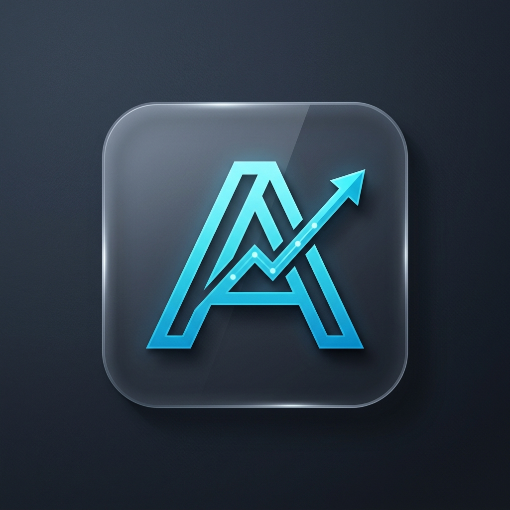

<div align="center">
  
  <h1>Arina Ledger</h1>
  <p><strong>A premium, offline-first financial accounting desktop application built for speed and security.</strong></p>
</div>

<br />

## 🌟 Overview
**Arina Ledger** is a modern, sleek desktop accounting tool originally designed to handle the fast-paced, privacy-critical daily financial operations of a hospital. It is now open-source and adaptable for local businesses and individuals who demand absolute privacy. It completely bypasses the cloud, ensuring your financial data never leaves your computer unless you explicitly share it. 

Featuring a stunning "dark metallic" and frosted glass interface, Arina Ledger makes tracking daily cash flow and net credit visually engaging and incredibly simple.

---

## ✨ Features

- 🎨 **Premium UI/UX:** A stunning dark-mode interface utilizing glassmorphism, metallic accents, dynamic gradients, and smooth micro-animations.
- ⚡ **Lightning Fast:** Optimized Electron boot sequence with lazy-loaded dependencies ensures the app snaps open instantly.
- 🔒 **100% Offline & Private:** All ledgers and transactions are securely encrypted and stored entirely on your local machine. No accounts, no cloud servers, no subscriptions.
- 📊 **Automated Excel Sync:** Seamlessly bind your ledger to a local `.xlsx` Excel file. The app automatically updates the spreadsheet in the background every time you add a transaction, complete with rich cell formatting, color-coding, and sub-totals.
- 🤝 **Secure Record Sharing:** Export ledgers as highly-portable `.hrec` (Hospital Record) files to share with accountants or partners. Includes advanced cryptographic ID generation and name-collision safeguards to prevent accidental data overwriting when importing.
- ⚠️ **Irreversible Destructive Protections:** Aggressive UI friction and exact-name-typing requirements protect against accidental deletion of your financial records.

---

## 🛠️ Technology Stack

Arina Ledger leverages a highly modern, incredibly fast technology stack:

- **Frontend:** [React 18](https://react.dev/) + [Vite](https://vitejs.dev/)
- **Backend / Desktop Engine:** [Electron](https://www.electronjs.org/)
- **Styling:** Custom CSS with Glassmorphism and CSS Variables
- **Icons:** [Lucide React](https://lucide.dev/)
- **Data Export:** [ExcelJS](https://github.com/exceljs/exceljs)

---

## 🚀 Getting Started

### Prerequisites
Make sure you have [Node.js](https://nodejs.org/) installed on your machine.

### Installation

1. **Clone the repository** (or download the source code):
   ```bash
   git clone <your-repo-url>
   cd "accounting app"
   ```

2. **Install dependencies:**
   *(Note: Ensure you install dependencies sequentially to avoid native-module conflicts)*
   ```bash
   npm install
   ```

3. **Run the Application:**
   Boot up both the Vite frontend server and the Electron desktop engine simultaneously:
   ```bash
   npm run electron:dev
   ```

---

## 📁 Project Structure

```text
arina-ledger/
├── electron/
│   ├── main.cjs        # Core Electron backend & Excel generation engine
│   └── preload.cjs     # Secure IPC bridge
├── public/
│   └── icon.png        # Official Arina Ledger desktop icon
├── src/
│   ├── lib/
│   │   └── storage.js  # File system logic and state utilities
│   ├── pages/          # React UI Views (Welcome, Dashboard, DailyDetails)
│   ├── styles/         # Global CSS, gradients, and animations
│   ├── App.jsx         # React Root & Routing logic
│   └── main.jsx        # React DOM entry
└── package.json        # Build scripts and dependencies
```

---

## 🛡️ Security & Privacy
Because Arina Ledger is designed to be an offline-first tool, it inherently protects you from data breaches. **However, please remember to regularly backup your local `hospital_records.json` file or use the built-in "Export / Share" feature to keep safe backups of your data!**
